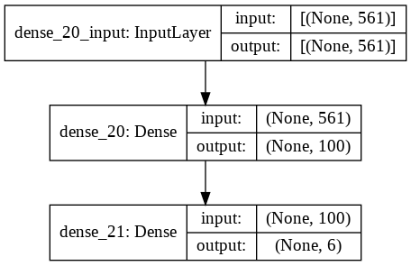

<html>

<head>
    <meta content="text/html; charset=UTF-8" http-equiv="content-type">
</head>

<body class="c43">
    <h2>PROJECT REPORT</h2>
    <h1 class="c29 title" id="h.gfq3p6qputkr">HUMAN ACTIVITY RECOGNITION USING SMARTPHONE DATASET</h1>
    

    

    

    <h4 class="c0" id="h.skx86xeedyvt">Adarsh Baghel 180001001</h4>
    <h4 class="c0" id="h.hkga0r456u1o">Jeevan Reddy 180001039</h4>
    <h4 class="c0" id="h.hkga0r456u1o-1">Ubaid Shaikh 180001050</h4>
    

    

    
Under the Guidance of

    <h4 class="c0" id="h.bj1k0pzhv4po">Dr Aruna Tiwari</h4>
    

    

        
Computer Science and Engineering

        
May 16, 2021

        

        <h2 class="c16" id="h.s3ol0wfmm2bu">Introduction:</h2>
        

        

            
Smartphones are the most useful tools of our daily life and with the advancing technology, they get more capable day by day to meet customer needs and expectations. To make these gadgets more functional and powerful, designers add new modules and devices to the hardware. Sensors have a big role in making smartphones more functional and aware of the environment thus most smartphones come with different embedded sensors and this makes it possible to collect vast amounts of information about the user&rsquo;s daily life and activities.

            

                
Accelerometer and gyroscope sensors are amongst these devices too. The accelerometer has been standard hardware for almost all smartphone manufacturers. As its name suggests, an accelerometer measures the change in speed; not the speed itself. Data retrieved from the accelerometer may be processed in order to detect sudden changes in movement. Another sensor that has been standard hardware for smartphones is the gyroscope which measures orientation by using gravity. Signals retrieved by gyroscope can be processed to detect the position and alignment of the device. Since there is a meaningful difference of characteristics between data retrieved from these sensors, many features could be generated from these sensor data to determine the activity of the person that is carrying the device. Classification of smartphone user activities has been focused on in different studies.

                

                    

                    <h2
                        class="c16" id="h.n2tapyv2rm99">Description of Dataset:</h2>
                        
The Human Activity Recognition database was built from the recordings of 30 study participants performing activities of daily living (ADL) while carrying a waist-mounted smartphone with embedded inertial sensors. The objective is to classify activities into one of the six activities performed.

                        

                            
The experiments have been carried out with a group of 30 volunteers within an age bracket of 19-48 years. Each person performed six activities (WALKING, WALKING UPSTAIRS, WALKING DOWNSTAIRS, SITTING, STANDING, LAYING) wearing a smartphone (Samsung Galaxy S II) on the waist. Using its embedded accelerometer and gyroscope, we captured 3-axial linear acceleration and 3-axial angular velocity at a constant rate of 50Hz. The experiments have been video-recorded to label the data manually. The obtained dataset has been randomly partitioned into two sets, where 70% of the volunteers were selected for generating the training data and 30% for the test data.

                            

                                
The sensor signals (accelerometer and gyroscope) were pre-processed by applying noise filters and then sampled in fixed-width sliding windows of 2.56 sec and 50% overlap (128 readings/window). The sensor acceleration signal, which has gravitational and body motion components, was separated using a Butterworth low-pass filter into body acceleration and gravity. The gravitational force is assumed to have only low-frequency components, therefore a filter with 0.3 Hz cutoff frequency was used. From each window, a vector of features was obtained by calculating variables from the time and frequency domain.

                                <h3
                                    class="c37 c44" id="h.n6dvxvxgg54a">Dataset Source:</h3>
                                    

                                    
<a class="c27" href="https://www.google.com/url?q=https://archive.ics.uci.edu/ml/datasets/Smartphone-Based%2BRecognition%2Bof%2BHuman%2BActivities%2Band%2BPostural%2BTransitions&amp;sa=D&amp;source=editors&amp;ust=1621446685401000&amp;usg=AOvVaw2CwSk0qHdXhxGUIk3HH8yS">https://archive.ics.uci.edu/ml/datasets/Smartphone-Based+Recognition+of+Human+Activities+and+Postural+Transitions</a>

                                    

                                        

                                        <h2
                                            class="c16" id="h.8f2yuq349jzk">Feature description:</h2>
                                            
                                            
                                            <table class="c15">
                                                <tbody>
                                                    <tr class="c11">
                                                        <td class="c40" colspan="1" rowspan="1">
                                                            

                                                        </td>
                                                        <td class="c47" colspan="1" rowspan="1">
                                                            

                                                            
Train Dataset distribution

                                                                

                                                                

                                                                

                                                                
Test Dataset distribution.

                                                        </td>
                                                    </tr>
                                                </tbody>
                                            </table>
                                            

                                            

                                            

                                            

                                            <h2 class="c16" id="h.29x3srsf2su">Overview of Dataset: </h2>
                                            

                                                
                                            

                                            

                                            

                                            

                                                
Learning Methods

                                                

                                                
Supervised machine learning is used to recognize activity from dataset records. Different supervised machine learning models designed using different classification approaches.

                                                

                                                    
Designed models are first trained with training data that consists of %80 of the total dataset and then tested with the rest. Classification precision of models is tested and observed using 5-fold cross-validation.

                                                    
&nbsp;

                                                        

                                                            <h2 class="c16" id="h.ly3o7e4bwea7">Artificial Neural Network</h2>
                                                            
An artificial neural network (ANN) is a computational model consisting of interconnected artificial neurons (or nodes) that are inspired by biological neural networks. ANNs are able to model complex relationships between inputs and outputs or to find patterns in data.

                                                            
In this project, we use a class of ANN called multilayer perceptron (MLP) as a classifier as illustrated in the following figure. The backpropagation algorithm is used in the training process.

                                                                

                                                                    

                                                                    
&nbsp;

                                                                    

                                                                        

                                                                        

                                                                        

                                                                        <h2 class="c16" id="h.2itg0cblnfsu">Activation Functions Used:</h2>
                                                                        

                                                                        
Sigmoid:&nbsp;The Sigmoid function is a smooth function and is continuously differentiable. The biggest advantage that it has over step and linear function is that it is non-linear. This is a very important feature of the sigmoid function. It essentially means that when we have multiple neurons having sigmoid function as their activation function &ndash; the output is non linear as well. The function ranges from 0-1 having an S shape. We are using the Sigmoid Activation function in the output layer of all our neural network models

                                                                            

                                                                                
Tanh:&nbsp;tanh is also like logistic sigmoid but better. The range of the tanh function is from (-1 to 1). tanh is also sigmoidal (s - shaped). The advantage is that the negative inputs will be mapped strongly negative and the zero inputs will be mapped near zero in the tanh graph. The function is differentiable. The function is monotonic while its derivative is not monotonic.

                                                                                

                                                                                    
Relu:&nbsp;The ReLU function is the Rectified linear unit. It is the most widely used activation function. We are using this in the hidden layers of 1st five neural network models. The main advantage of using the ReLU function over other activation functions is that it does not activate all the neurons at the same time. If the input is negative it will convert it to zero and the neuron does not get activated.

                                                                                    

                                                                                        

                                                                                        

                                                                                        

                                                                                        

                                                                                        

                                                                                        <h2 class="c16" id="h.3z5qzbwdivot">Results and Analysis:</h2>
                                                                                        

                                                                                        
                                                                                        
                                                                                        <table class="c15">
                                                                                            <tbody>
                                                                                                <tr class="c11">
                                                                                                    <td class="c22 c25" colspan="1" rowspan="1">
                                                                                                        
Model 1

                                                                                                    </td>
                                                                                                </tr>
                                                                                                <tr class="c11">
                                                                                                    <td class="c22" colspan="1" rowspan="1">
                                                                                                        
Accuracy: 95.59%

                                                                                                    </td>
                                                                                                </tr>
                                                                                                <tr class="c11">
                                                                                                    <td class="c22" colspan="1" rowspan="1">
                                                                                                        

                                                                                                        
epochs = 10 &nbsp;&#8203;

                                                                                                            
k = 5&#8203;

                                                                                                            
hidden neurons = 10

                                                                                                            
single hidden layer

                                                                                                    </td>
                                                                                                </tr>
                                                                                                <tr class="c11">
                                                                                                    <td class="c22" colspan="1" rowspan="1">
                                                                                                        

                                                                                                    </td>
                                                                                                </tr>
                                                                                            </tbody>
                                                                                        </table>
                                                                                        

                                                                                        
                                                                                        
                                                                                        <table class="c15">
                                                                                            <tbody>
                                                                                                <tr class="c11">
                                                                                                    <td class="c1 c34" colspan="1" rowspan="1">
                                                                                                        
Model 2

                                                                                                    </td>
                                                                                                </tr>
                                                                                                <tr class="c11">
                                                                                                    <td class="c1" colspan="1" rowspan="1">
                                                                                                        
Accuracy: 94.06%

                                                                                                    </td>
                                                                                                </tr>
                                                                                                <tr class="c33">
                                                                                                    <td class="c1" colspan="1" rowspan="1">
                                                                                                        

                                                                                                        
epochs = 10 &nbsp;&#8203;

                                                                                                            
k = 5&#8203;

                                                                                                            
hidden neurons = 50&#8203;

                                                                                                            
single hidden layer

                                                                                                    </td>
                                                                                                </tr>
                                                                                                <tr class="c11">
                                                                                                    <td class="c1" colspan="1" rowspan="1">
                                                                                                        

                                                                                                    </td>
                                                                                                </tr>
                                                                                            </tbody>
                                                                                        </table>
                                                                                        

                                                                                        

                                                                                        

                                                                                        
                                                                                        
                                                                                        <table class="c15">
                                                                                            <tbody>
                                                                                                <tr class="c11">
                                                                                                    <td class="c19 c34" colspan="1" rowspan="1">
                                                                                                        
Model 3

                                                                                                    </td>
                                                                                                </tr>
                                                                                                <tr class="c11">
                                                                                                    <td class="c19" colspan="1" rowspan="1">
                                                                                                        
Accuracy: 94.77%

                                                                                                    </td>
                                                                                                </tr>
                                                                                                <tr class="c11">
                                                                                                    <td class="c19" colspan="1" rowspan="1">
                                                                                                        

                                                                                                        
epochs = 100 &nbsp;&#8203;

                                                                                                            
k = 5&#8203;

                                                                                                            
hidden neurons = 100&#8203;

                                                                                                            
single hidden layer&#8203;

                                                                                                    </td>
                                                                                                </tr>
                                                                                                <tr class="c11">
                                                                                                    <td class="c19" colspan="1" rowspan="1">
                                                                                                        

                                                                                                    </td>
                                                                                                </tr>
                                                                                            </tbody>
                                                                                        </table>
                                                                                        

                                                                                        

                                                                                        
                                                                                        
                                                                                        <table class="c15">
                                                                                            <tbody>
                                                                                                <tr class="c11">
                                                                                                    <td class="c19 c34" colspan="1" rowspan="1">
                                                                                                        
Model 4

                                                                                                    </td>
                                                                                                </tr>
                                                                                                <tr class="c11">
                                                                                                    <td class="c19" colspan="1" rowspan="1">
                                                                                                        
Accuracy: 94.40%

                                                                                                    </td>
                                                                                                </tr>
                                                                                                <tr class="c11">
                                                                                                    <td class="c19" colspan="1" rowspan="1">
                                                                                                        

                                                                                                        
epochs = 100 &nbsp;&#8203;

                                                                                                            
No cross fold validation&#8203;

                                                                                                            
hidden neurons = 100&#8203;

                                                                                                            
single hidden layer&#8203;

                                                                                                    </td>
                                                                                                </tr>
                                                                                                <tr class="c11">
                                                                                                    <td class="c19" colspan="1" rowspan="1">
                                                                                                        

                                                                                                    </td>
                                                                                                </tr>
                                                                                            </tbody>
                                                                                        </table>
                                                                                        

                                                                                        
                                                                                        
                                                                                        <table class="c15">
                                                                                            <tbody>
                                                                                                <tr class="c11">
                                                                                                    <td class="c19 c34" colspan="1" rowspan="1">
                                                                                                        
Model 5

                                                                                                    </td>
                                                                                                </tr>
                                                                                                <tr class="c11">
                                                                                                    <td class="c19" colspan="1" rowspan="1">
                                                                                                        
Accuracy: 95.45%

                                                                                                    </td>
                                                                                                </tr>
                                                                                                <tr class="c11">
                                                                                                    <td class="c19" colspan="1" rowspan="1">
                                                                                                        

                                                                                                        
epochs = 100 &nbsp;&#8203;

                                                                                                            
No cross fold validation&#8203;

                                                                                                            
hidden neurons = 100, 50&#8203;

                                                                                                            
two hidden layer&#8203;

                                                                                                    </td>
                                                                                                </tr>
                                                                                                <tr class="c11">
                                                                                                    <td class="c19" colspan="1" rowspan="1">
                                                                                                        

                                                                                                    </td>
                                                                                                </tr>
                                                                                            </tbody>
                                                                                        </table>
                                                                                        

                                                                                        
                                                                                        
                                                                                        <table class="c15">
                                                                                            <tbody>
                                                                                                <tr class="c11">
                                                                                                    <td class="c19 c34" colspan="1" rowspan="1">
                                                                                                        
Model 6

                                                                                                    </td>
                                                                                                </tr>
                                                                                                <tr class="c11">
                                                                                                    <td class="c19" colspan="1" rowspan="1">
                                                                                                        
Accuracy: 95.08%

                                                                                                    </td>
                                                                                                </tr>
                                                                                                <tr class="c11">
                                                                                                    <td class="c19" colspan="1" rowspan="1">
                                                                                                        

                                                                                                        
epochs = 100 &#8203;

                                                                                                            
Hidden layer Activation = tanh &#8203;

                                                                                                            
No cross fold validation&#8203;

                                                                                                            
hidden layer neurons = 100&#8203;

                                                                                                            
single hidden layer&#8203;

                                                                                                    </td>
                                                                                                </tr>
                                                                                                <tr class="c11">
                                                                                                    <td class="c19" colspan="1" rowspan="1">
                                                                                                        

                                                                                                    </td>
                                                                                                </tr>
                                                                                            </tbody>
                                                                                        </table>
                                                                                        

                                                                                        <h2 class="c16" id="h.j1xin3sf1tt2">Analysing with different optimisers:</h2>
                                                                                        

                                                                                        

                                                                                        
                                                                                        
                                                                                        <table class="c15">
                                                                                            <tbody>
                                                                                                <tr class="c11">
                                                                                                    <td class="c42" colspan="1" rowspan="1">
                                                                                                        <ul class="c9 lst-kix_o4tf31klb6zw-0 start">
                                                                                                            <li class="c2 li-bullet-0">Adam</li>
                                                                                                            <li class="c2 li-bullet-0">RMSprop</li>
                                                                                                            <li class="c2 li-bullet-0">Adamax</li>
                                                                                                            <li class="c2 li-bullet-0">Adagrad</li>
                                                                                                        </ul>
                                                                                                    </td>
                                                                                                    <td class="c38" colspan="1" rowspan="1">
                                                                                                        

                                                                                                        
Fig: Comparing epoch_ accuracy with optimizers

                                                                                                            

                                                                                                            

                                                                                                            

                                                                                                    </td>
                                                                                                </tr>
                                                                                                <tr class="c11">
                                                                                                    <td class="c42" colspan="1" rowspan="1">
                                                                                                        <ul class="c9 lst-kix_o4tf31klb6zw-0">
                                                                                                            <li class="c2 li-bullet-0">Adam</li>
                                                                                                            <li class="c2 li-bullet-0">RMSprop</li>
                                                                                                            <li class="c2 li-bullet-0">Adamax</li>
                                                                                                            <li class="c2 li-bullet-0">Adagrad</li>
                                                                                                        </ul>
                                                                                                    </td>
                                                                                                    <td class="c38" colspan="1" rowspan="1">
                                                                                                        

                                                                                                        
Fig: Comparing epoch_ loss with optimizers

                                                                                                    </td>
                                                                                                </tr>
                                                                                            </tbody>
                                                                                        </table>
                                                                                        

                                                                                        

                                                                                        

                                                                                        <h2 class="c16" id="h.iyd98013yx63">Accuracy and Loss of Model 5 and Model 6</h2>
                                                                                        

                                                                                        

                                                                                        

                                                                                        
&nbsp;&nbsp;&nbsp;&nbsp;&nbsp;&nbsp;&nbsp;&nbsp;Fig: Comparing epoch accuracy of Model 5 and Model 6

                                                                                            

                                                                                            

                                                                                            

                                                                                            

                                                                                            

                                                                                            
Fig: Comparing epoch loss for Model 5 and Model 6
                                                                                                

                                                                                                

                                                                                                <h2 class="c16" id="h.vl293tg31ll1">Ranking of Features based on their Impact:</h2>
                                                                                                

                                                                                                    Observations:
                                                                                                

                                                                                                

                                                                                                <ol class="c9 lst-kix_qr1mduem8qpm-0 start" start="1">
                                                                                                    <li class="c3 c5 li-bullet-1">From the Model 6 Vs Model 5 epochs and accuracy graph, we see that model 6 is performing better than model 5. Model 5 is using relu function, whereas Model 6 is using tanh function. The advantage of Tanh function is that it can center the data obtained from its previous layer.</li>
                                                                                                </ol>
                                                                                                

                                                                                                <ol class="c9 lst-kix_qr1mduem8qpm-0" start="2">
                                                                                                    <li class="c3 c5 li-bullet-1">From the confusion matrices, we observe that our model is getting confused between standing and sitting. It is wrongly classifying the sitting input vectors to be that of standing and standing input vectors to that of sitting. Our explanation is that in both the standing and sitting cases, the smartphone remains in a still position and hence our models find it difficult to classify the sitting and standing input vectors.
                                                                                                        

                                                                                                    </li>
                                                                                                </ol>
                                                                                                <h2 class="c16" id="h.o88v84diaxda">Conclusion:</h2>
                                                                                                
We compared different neural networks learning models by changing their various hyper parameter values, for example: number of epochs, activation functions, number of hidden layers, number of hidden layer neurons. We also tried using kFoldCross Validation for testing some models. 

                                                                                                
We tried several neural networks models with different optimizers and on an average we are getting accuracy around 95% and the maximum accuracy achieved was 96.00% with Adamax optimizer.

                                                                                                    

                                                                                                        
Dataset used in this study contains data generated solely from accelerometer and gyroscope signals. This work could be improved by increasing the number of activities and situations to classify and to add data received from other sensors and devices that are commonly used in smartphones. Some of these devices are magnetometer, light sensor, proximity sensor, barometer, termometer, pedometer, heart pulse monitor, GPS and microphone. With help of these devices it would be possible to get information about the condition and location of the user and situation of the environment in order to classify much more complex activities and situations.

                                                                                                        

                                                                                                            <h2 class="c16" id="h.9u5gws3ziv50">References:</h2>
                                                                                                            <ol class="c9 lst-kix_qvx3ncghibma-0 start" start="1">
                                                                                                                <li class="c3 c5 li-bullet-1">E. Bulbul, A. Cetin and I. A. Dogru, &quot;Human Activity Recognition Using Smartphones,&quot; 2018 2nd International Symposium on Multidisciplinary Studies and Innovative Technologies (ISMSIT), Ankara, Turkey, 2018, pp. 1-6, doi: 10.1109/ISMSIT.2018.8567275.&#8203;</li>
                                                                                                                <li
                                                                                                                    class="c3 c5 li-bullet-1">Akram Bayat, Marc Pomplun, Duc A. Tran, A Study on Human Activity Recognition Using Accelerometer Data from Smartphones, Procedia Computer Science, Volume 34, 2014, Pages 450-457, ISSN 1877-0509, 
                                                                                                                    <a class="c27" href="https://www.google.com/url?q=https://doi.org/10.1016/j.procs.2014.07.009&amp;sa=D&amp;source=editors&amp;ust=1621446685426000&amp;usg=AOvVaw016p_QAkYXG6RD3j243mAJ">https://doi.org/10.1016/j.procs.2014.07.009</a>
                                                                                                                        &nbsp;(<a class="c27" href="https://www.google.com/url?q=https://www.sciencedirect.com/science/article/pii/S1877050914008643&amp;sa=D&amp;source=editors&amp;ust=1621446685427000&amp;usg=AOvVaw1Szprx6vuYztijnM7S5rD1">https://www.sciencedirect.com/science/article/pii/S1877050914008643</a>
                                                                                                                            )&#8203;
                                                                                                                                </li>
                                                                                                                                <li class="c3 c5 li-bullet-1">Rasekh, Amin &amp; Chen, Chien-An &amp; Lu, Yan. (2014). Human Activity Recognition using Smartphone. &#8203;</li>
                                                                                                                                <li
                                                                                                                                    class="c3 c5 li-bullet-1">Jorge-L. Reyes-Ortiz, Luca Oneto, Albert Sam&Atilde; , Xavier Parra, Davide Anguita. Transition-Aware Human Activity Recognition Using Smartphones. Neurocomputing. Springer 2015.&#8203;</li>
                                                                                                            </ol>
                                                                                                            

</body>

</html>